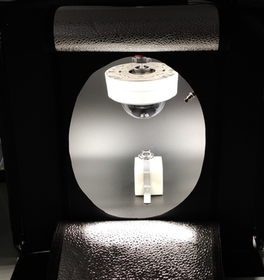

  <h3 align="center">Enable the power of AWS Rekognition to your Axis camera</h3>
  <h3 align="center"><a href="https://medium.com/daniel-wellington-tech-stories"></a> </h3>

<p align="center">
    This proof of concept will enable the power of AWS Rekognition OCR to your Axis camera, with some few changes you can change to the object rekognition. The project it self is based on AWS IOT Core (Secure MQTT with client certificate) instead of the API Gateway (HTTPS endpoint) to get better performance as establishing a HTTPS connection each time is to much overhead and MQTT is meant to be a IOT protocol. Read more about this use case in the medium link above.
    <br />
    <br />
      
    <br />
    <br />
    This is the example setup we have, the reason for the light tent is that we want to make sure we always get the same "controlled environment" where it is going to get deployed and the same lighning and reflection (dont underestamate reflections!). We have also a button to trigger the event through the IO port of the camera so we are super cost efficent. 
    <br />
    <br />
        
    <br />
    <br />

  The camera runs a ACAP that takes care of sending the data over secure mqtt (AWS IoT Core) together with the image base64 encoded in a json object. The IoT rule triggers the lambda with the json object to process the data and trigger rekognition service. The result from Rekognition service and the image sent is stored on S3 for debugging reasons and will be automatically deleted after defined period. The lambda it self will take the matched regexp result to put back on AWS IOT Core.
</p>


## Table of Contents

* [About the Project](#about-the-project)
  * [Built With](#built-with)
* [Getting Started](#getting-started)
  * [Prerequisites](#prerequisites)
  * [Deployment on AWS](#deployment-on-aws)
  * [Configure Axis camera](#configure-axis-camera)
* [Usage](#usage)
* [Contributing](#contributing)
  * [Pull request wishlist](#pull-request-wishlist)
* [License](#license)
* [Contact](#contact)


## About The Project


<!-- medium article [![Product Name Screen Shot][product-screenshot]](https://example.com) -->


### Built With

* [Axis camera running firmware 10+]()
* [Axis ACAP for secure MQTT support (until its coming to the firmware)](https://github.com/aintegration/acaps/tree/master/Publisher)
* [AWS Rekognition](https://aws.amazon.com/rekognition/)
* [AWS Lambda](https://aws.amazon.com/lambda/)
* [AWS S3](https://aws.amazon.com/s3/)
* [AWS IOT Core](https://aws.amazon.com/iot-core/)


## Getting Started


### Prerequisites

The following needs to be on your machine to be able to deploy
* make
* go
* git
* cat
* aws-cli

### Deployment on AWS

1. Clone the repo
```sh
git clone https://github.com/dwtechnologies/axis-aws-rekognition.git
```
2. Edit parameters file 
2.1 Define the topics, the input topic must match the same as on the axis camera
```sh
IoTInputTopic="the-name-of-the-topic-axis-camera-will-publish-to"
```

2.2 Set the IOT endpoint, must be the same in the axis camera. You can find it here https://console.aws.amazon.com/iotv2/home?region=eu-west-1#/settings and make sure you are in the same region as defined in Makefile

```sh
IoTEndpoint="https://The-AWS-IOT-ENDPOINT"
```
2.3 Set the regexp to match the pattern you are looking for
```sh
RegexMatch=""
```
3. Edit the Makefile
3.1 Set the Artifact S3 bucket that you have permission to upload the lambda artifact to
```sh
ARTIFACTS_BUCKET   =  s3-bucket-to-upload-the-lambda-artifact-for-deploy
```
3.2 Set the AWS Region where you will deploy to, make sure its the same as the IOT endpoint
```sh
AWS_DEFAULT_REGION ?= eu-west-1
```
3.3 Set what aws-cli profile you will use
```sh
AWS_PROFILE ?= your-aws-cli-profile
```

4. Deploy
```sh
make deploy
```

### Configure Axis camera

1. Make sure you are running firmware 10+ on your Camera
2. Download and install the ACAP to get client certificate support for secure MQTT from https://github.com/aintegration/acaps/tree/master/Publisher
3. Make sure that you start the Axis publisher (the start toggle) 
[start-acap]: images/acap-start.png
4. Set the "Type" to MQTT Broker
5. The Address:port is the IOT endpoint, same as in the parameters (IoTEndpoint) but remove https and add :8883 in the end
6. No need to change Client ID but make sure Topic is the same as in the parameters (IoTInputTopic) and TLS set to Verify server certificate
7. Generate cert, go to set client tls cert and paste it
8. Set the trigger in event 
9. Image to yes and the resolution you want (only tested with 640x360, not sure of payload limit on aws iot core). If you have cropped the image (view area), choose what number of that
10. Do save, hopefully Status will be connected, if not check the error logs (make sure your time is ntp synced on the camera to be able to verify the certs)
## Usage

Based on the trigger that is configure for the Publisher ACAP, that one will put the message on MQTT
The image taken from the camera should be triggered (motion, button or something similar?) to then send the image to aws. The result matched result will be put on the output topic (IoTInputTopic) and in the cloudwatch logs together with S3.


## Contributing

Any contributions you make are **greatly appreciated** but please have in mind to make what you create must be dynamic to not break current use case

1. Fork the Project
2. Create your Feature Branch (`git checkout -b feature/AmazingFeature`)
3. Commit your Changes (`git commit -m 'Add some AmazingFeature'`)
4. Push to the Branch (`git push origin feature/AmazingFeature`)
5. Open a Pull Request


### Pull request wishlist
* Dynamic setup to be able to switch between AWS Rekognition OCR & Object/Scene rekognition
* Fetch the IOT endpoint dynamically in the lambda instead of define it
* Dynamically in the code+cloudformation to support Other destination to push matched data, such as invoke another lambda, api gateway websocket, dynamodb, kinesis etc. Example of SNS is there

## License

Distributed under the GPL-3.0 License. See `LICENSE` for more information.


## Contact

Lezgin Bakircioglu - <a href="https://twitter.com/lerra82"></a> 
<a href="https://medium.com/@lerra82"></a> 
